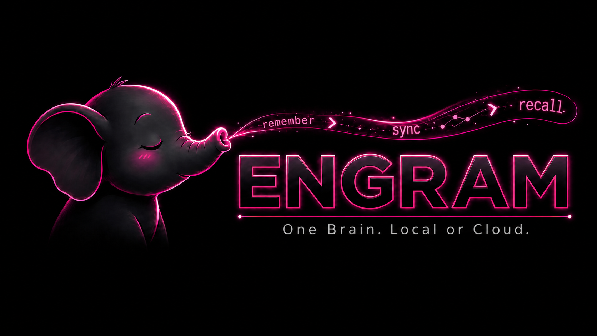
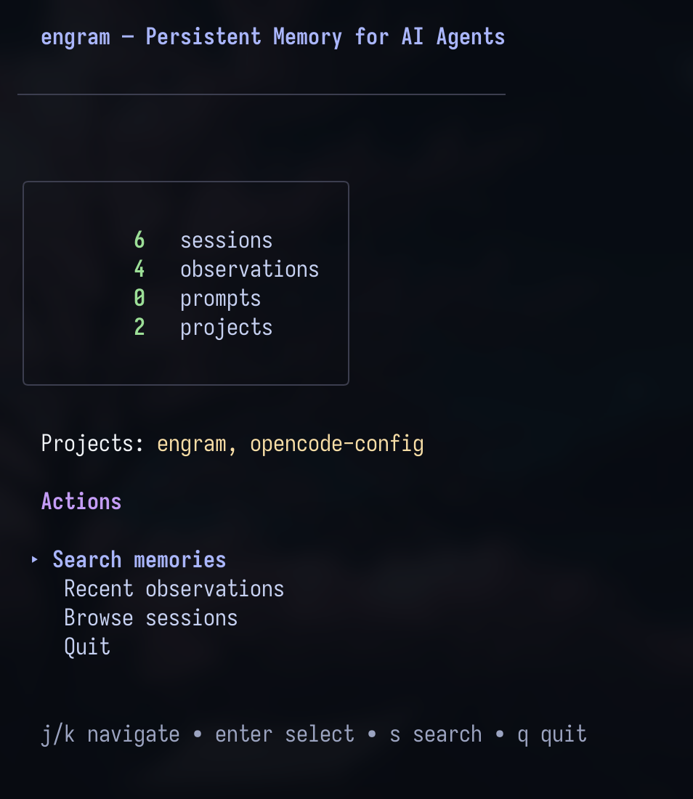
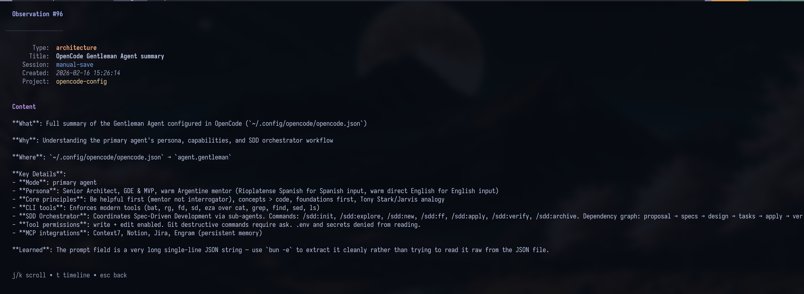
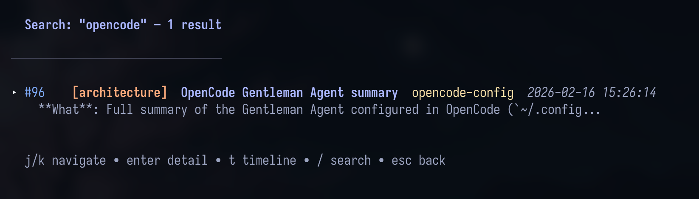

<p align="center">
  
</p>

<p align="center">
  <strong>Persistent memory for AI coding agents</strong><br>
  <em>One brain. Local or cloud. Agent-agnostic, single binary, zero dependencies.</em>
</p>

<p align="center">
  <a href="docs/INSTALLATION.md">Installation</a> &bull;
  <a href="docs/engram-cloud/README.md">Engram Cloud</a> &bull;
  <a href="docs/AGENT-SETUP.md">Agent Setup</a> &bull;
  <a href="docs/CODEBASE-GUIDE.md">Codebase Guide</a> &bull;
  <a href="docs/ARCHITECTURE.md">Architecture</a> &bull;
  <a href="docs/PLUGINS.md">Plugins</a> &bull;
  <a href="docs/TEAM-USAGE.md">Team Usage</a> &bull;
  <a href="CONTRIBUTING.md">Contributing</a> &bull;
  <a href="DOCS.md">Full Docs</a>
</p>

---

> **engram** `/ˈen.ɡræm/` — _neuroscience_: the physical trace of a memory in the brain.

Your AI coding agent forgets everything when the session ends. Engram gives it a brain.

A **Go binary** with SQLite + FTS5 full-text search, exposed via CLI, HTTP API, MCP server, and an interactive TUI. Works with **any agent** that supports MCP — Claude Code, OpenCode, Gemini CLI, Codex, VS Code (Copilot), Antigravity, Cursor, Windsurf, or anything else.

```
Agent (Claude Code / OpenCode / Gemini CLI / Codex / VS Code / Antigravity / ...)
    ↓ MCP stdio
Engram (single Go binary)
    ↓
SQLite + FTS5 (~/.engram/engram.db)
```

## Quick Start

### Install

```bash
brew install gentleman-programming/tap/engram
```

Windows, Linux, and other install methods → [docs/INSTALLATION.md](docs/INSTALLATION.md)

### Setup Your Agent

| Agent                       | One-liner                                                                                    |
| --------------------------- | -------------------------------------------------------------------------------------------- |
| Claude Code                 | `claude plugin marketplace add Gentleman-Programming/engram && claude plugin install engram` |
| Pi                          | `engram setup pi`                                                                            |
| OpenCode                    | `engram setup opencode`                                                                      |
| Gemini CLI                  | `engram setup gemini-cli`                                                                    |
| Codex                       | `engram setup codex`                                                                         |
| Antigravity CLI             | `engram setup antigravity-cli`                                                               |
| Windsurf                    | `engram setup windsurf`                                                                      |
| Qwen Code                   | `engram setup qwen`                                                                          |
| Kiro                        | `engram setup kiro`                                                                          |
| Cursor                      | `engram setup cursor`                                                                        |
| VS Code (Copilot)           | `engram setup vscode-copilot`                                                                |
| Kilo Code                   | `engram setup kilocode`                                                                      |
| Any other MCP client        | See [docs/AGENT-SETUP.md](docs/AGENT-SETUP.md)                                               |

Full per-agent config, Memory Protocol, and compaction survival → [docs/AGENT-SETUP.md](docs/AGENT-SETUP.md)

**What `engram setup` does** — it writes MCP config and plugin files for the chosen agent. After setup, restart your agent and it is ready. No server to start manually.

> **Do I need to run `engram serve` or `engram mcp` myself?**
>
> For most agents (Claude Code, Gemini CLI, Codex, VS Code, Cursor, Windsurf) — **no**. Your agent launches `engram mcp` automatically as a short-lived stdio subprocess whenever it starts a session. You never run it manually.
>
> `engram serve` is only needed when a plugin uses the HTTP API for session tracking: the **OpenCode plugin** and the **Pi extension** both talk to `engram serve` in the background. `engram setup opencode` and `engram setup pi` note this; the plugins auto-start the server when possible. If your environment blocks background processes, start it manually in a separate terminal:
> ```bash
> engram serve   # runs on port 7437 by default; keep it running
> ```
> You do not need `engram serve` at all for stdio-only agents (Claude Code, Gemini CLI, Codex, VS Code, Cursor, Windsurf).

No Node.js, no Python, no Docker. **One binary, one SQLite file.**

### Pi Package

Engram has a first-class Pi package: [`gentle-engram`](plugin/pi/README.md).

```bash
engram setup pi
```

It gives Pi persistent project memory, compaction recovery, and shared memory with other MCP agents through the same local-or-cloud Engram brain. The package is part of the Gentleman Programming agentic-coding ecosystem alongside Gentle-AI, SDD, skills, and Engram Cloud.

### Setup FAQ

**When do I need to manually add config to my agent's prompt or settings?**

`engram setup` covers the MCP wiring automatically. Manual config — adding a Memory Protocol snippet to your `CLAUDE.md`, `GEMINI.md`, `.cursorrules`, etc. — is only needed if your agent keeps forgetting to use Engram after long sessions or context compaction. That manual step is called the "nuclear option" in the detailed docs because system prompts survive everything, including compaction. It is a reliability boost for heavy users, not a required first step. See [Agent Setup → Surviving Compaction](docs/AGENT-SETUP.md#surviving-compaction-recommended) for the snippets.

**Can Docker agents (or remote agents) connect to Engram's MCP?**

Engram's MCP transport is **stdio only** — there is no HTTP or network MCP endpoint. `engram mcp` speaks the MCP protocol over stdin/stdout; it cannot be reached over a TCP port.

If you have agents running in Docker that need to write to Engram on the host, the available paths are:

- **HTTP REST API** (`engram serve`): note that `engram serve` currently binds to `127.0.0.1` only, so it is **not** reachable from inside a container out of the box — a container cannot reach the host's loopback, and there is no bind-address flag yet. `ENGRAM_URL` lets the **Pi plugin** target an `engram serve` reachable on a routable host/port (e.g. `ENGRAM_URL=http://host.docker.internal:7437 pi`), but that only works once the server listens on a non-loopback interface, which is not supported today. The HTTP API is not the MCP protocol; Pi uses it for session capture and Pi-native `mem_*` tools. For Docker right now, prefer the stdio path below.
- **Stdio MCP** (mount the binary): the cleanest path for a Dockerized agent that needs MCP tools is to mount the `engram` binary into the container and let the agent launch `engram mcp` locally via stdio, pointing `ENGRAM_DATA_DIR` at a volume shared with the host.

Full environment variable reference → [DOCS.md#environment-variables](DOCS.md#environment-variables)

## How It Works

```
1. Agent completes significant work (bugfix, architecture decision, etc.)
2. Agent calls mem_save → title, type, What/Why/Where/Learned
3. Engram persists to SQLite with FTS5 indexing
4. Next session: agent searches memory, gets relevant context
```

Full details on session lifecycle, topic keys, and memory hygiene → [docs/ARCHITECTURE.md](docs/ARCHITECTURE.md)

## MCP Tools (20)

| Category               | Tools                                                                                                            |
| ---------------------- | ---------------------------------------------------------------------------------------------------------------- |
| **Save & Update**      | `mem_save`, `mem_update`, `mem_delete`, `mem_suggest_topic_key`                                                  |
| **Search & Retrieve**  | `mem_search`, `mem_context`, `mem_timeline`, `mem_get_observation`                                               |
| **Session Lifecycle**  | `mem_session_start`, `mem_session_end`, `mem_session_summary`                                                    |
| **Conflict Surfacing** | `mem_judge`, `mem_compare`                                                                                       |
| **Lifecycle Review**   | `mem_review`                                                                                                      |
| **Utilities**          | `mem_save_prompt`, `mem_stats`, `mem_capture_passive`, `mem_merge_projects`, `mem_current_project`, `mem_doctor` |

Full tool reference with parameters → [DOCS.md#mcp-tools-20-tools](DOCS.md#mcp-tools-20-tools)

## Terminal UI

```bash
engram tui
```

<p align="center">

  
  
  
</p>

**Navigation**: `j/k` vim keys, `Enter` to drill in, `c` to copy content to clipboard (OSC 52), `/` to search, `Esc` back. Catppuccin Mocha theme.

## Git Sync

Share memories across machines. Uses compressed chunks — no merge conflicts, no huge files.

Local SQLite remains the source of truth. Cloud integration is opt-in replication.

```bash
engram sync                    # Export new memories as compressed chunk
git add .engram/ && git commit -m "sync engram memories"
engram sync --import           # On another machine: import new chunks
engram sync --status           # Check sync status
```

Full sync documentation → [DOCS.md](DOCS.md)

## Cloud Integration (Opt-In Replication)

Cloud is optional. Local SQLite stays authoritative; cloud is replication/shared access only.

**Recommended first path (local smoke):**

```bash
docker compose -f docker-compose.cloud.yml up -d
engram cloud config --server http://127.0.0.1:18080
engram cloud enroll smoke-project
engram sync --cloud --project smoke-project
```

Cloud mode is always project-scoped (`--project` is required; `engram sync --cloud --all` is intentionally blocked).
`ENGRAM_CLOUD_ALLOWED_PROJECTS` is required for `engram cloud serve` in both token-auth and insecure modes. Set it to `*` to allow all projects (useful for dev/internal deploys) — this bypasses per-project name enforcement while still requiring a non-empty project on each request.
Known repairable cloud sync/upsert/canonicalization failures keep the original error visible and recommend the explicit `doctor`/`repair` flow below; Engram never auto-applies repair from sync or autosync.
For blocked cloud sync, `transport_failed`, or legacy session directory repair, see [Engram Cloud Troubleshooting](docs/engram-cloud/troubleshooting.md).
If cloud sync stays blocked after `doctor`/`repair`, download the rescue helper and run the recommended exported-row repair:

```bash
tools/repair-missing-session-directory.sh --apply --interactive --fix-exported <project>
engram sync --cloud --project <project>
```

`--fix-exported` repairs local exported `sessions[].directory` and `observations[]` required fields that can still break the final push after `doctor` reports ready. For sequential legacy `sync_mutations` blockers, use `tools/repair-missing-session-directory.sh --apply --interactive --all <project>`.

**After upgrading `engram` while an MCP client is already running:**

```bash
engram setup claude-code
```

Then restart Claude Code so it reloads the Engram MCP subprocess and refreshed hook/config files. Updating the `engram` binary on disk does not replace an already-running stdio MCP process.

**Upgrade flow for existing local databases** (diagnose → repair → bootstrap → status):

```bash
engram cloud upgrade doctor --project smoke-project        # read-only readiness check
engram cloud upgrade repair --project smoke-project --dry-run
engram cloud upgrade repair --project smoke-project --apply
engram cloud upgrade bootstrap --project smoke-project     # resumable enroll + push + verify
engram cloud upgrade status --project smoke-project        # stage/class/reason
```

See [DOCS.md — Cloud upgrade flow](DOCS.md#cloud-upgrade-flow) for the full state machine.

For authenticated mode, upgrade flow, dashboard behavior, reason codes, and full runtime/env details:

- [Engram Cloud docs landing](docs/engram-cloud/README.md)
- [Engram Cloud quickstart](docs/engram-cloud/quickstart.md)
- [DOCS.md — Cloud CLI reference](DOCS.md#cloud-cli-opt-in)
- [DOCS.md — Cloud Autosync](DOCS.md#cloud-autosync)

## Steps to Test (Beta — Phases 2+3+4)

Try the new memory-conflict-surfacing features in **complete isolation** from your existing engram setup. Docker uses non-default ports + a separate data dir + a beta-only token, so your prod cloud and `~/.engram/` are untouched. Cleanup is one command.

**What's in the beta**:

- 🔄 Cloud sync of conflict relations cross-machine
- 🔍 `engram conflicts` CLI + HTTP API for retroactive audit + scan
- 🧠 `--semantic` scan that uses **your existing Claude Code or OpenCode CLI** to judge FTS5 conflict candidates with LLM reasoning — **$0 if you're on a Pro/Max/Plus subscription**

### Setup (4 commands)

```bash
git clone https://github.com/Gentleman-Programming/engram.git engram-beta-repo
cd engram-beta-repo && git checkout feat/memory-conflict-surfacing-cloud-sync
docker compose -f docker-compose.beta.yml up -d
go build -o ./engram-beta ./cmd/engram

# Isolated env (does NOT touch ~/.engram or your prod cloud)
export ENGRAM_DATA_DIR=/tmp/engram-beta-data
export ENGRAM_CLOUD_SERVER=http://127.0.0.1:28080
export ENGRAM_CLOUD_TOKEN=beta-token-CHANGE-ME-please-32chars
mkdir -p "$ENGRAM_DATA_DIR"
```

### Use cases

**1️⃣ Phase 1 — Conflict detection on save (sanity)**

```bash
./engram-beta save \
  "Use Clean Architecture" \
  "Layers: entities, use cases, adapters." \
  --type architecture --project beta-test

./engram-beta save \
  "Use Hexagonal Architecture" \
  "Ports and adapters separate domain from infra." \
  --type architecture --project beta-test
```

✅ Second save returns `candidates[]` with the first memory's id.

**2️⃣ Phase 2 — Cloud sync of relations cross-machine**

```bash
./engram-beta cloud enroll beta-test
./engram-beta sync --cloud --project beta-test
./engram-beta cloud status

# Simulate a "second machine"
ENGRAM_DATA_DIR=/tmp/engram-beta-data-2 ./engram-beta cloud enroll beta-test
ENGRAM_DATA_DIR=/tmp/engram-beta-data-2 ./engram-beta sync --cloud --project beta-test
ENGRAM_DATA_DIR=/tmp/engram-beta-data-2 ./engram-beta search "Architecture"
```

✅ The "second machine" sees memories synced from the first.

**3️⃣ Phase 3 — Admin CLI + HTTP API**

```bash
./engram-beta conflicts list --project beta-test
./engram-beta conflicts stats --project beta-test
./engram-beta conflicts scan --project beta-test --dry-run
./engram-beta conflicts scan --project beta-test --apply --max-insert 10

# In another terminal: ./engram-beta serve
curl -s "http://127.0.0.1:7437/conflicts?project=beta-test" | jq
```

✅ List/scan/stats return sensible data.

**4️⃣ Phase 4 — Semantic LLM-judge (the killer feature) 🎯**

```bash
export ENGRAM_AGENT_CLI=claude   # or opencode

./engram-beta conflicts scan --project beta-test --semantic --apply \
  --max-semantic 5 --concurrency 3 --yes
```

✅ Your agent's LLM judges semantic similarity. **$0 if on a subscription**.

**5️⃣ The case where FTS5 finds a candidate, then the LLM judges meaning**

Lexically related candidate titles with a semantic conflict:

```bash
./engram-beta save \
  "Use Postgres for the user database" \
  "Postgres 15 is our SQL store for users." \
  --type architecture --project beta-test

./engram-beta save \
  "Replace the user database with MongoDB" \
  "Document store now backs the user collection. SQL is gone." \
  --type decision --project beta-test

./engram-beta conflicts scan --project beta-test --semantic --apply \
  --max-semantic 5 --yes

./engram-beta conflicts list --project beta-test --status judged
```

✅ FTS5 supplies the candidate pair through shared title terms like `user` / `database`; the LLM then judges whether it is `supersedes` / `conflicts_with`. `--semantic` does not discover totally lexically unrelated pairs on its own.

### Cleanup (zero residue)

```bash
docker compose -f docker-compose.beta.yml down -v
rm -rf /tmp/engram-beta-data /tmp/engram-beta-data-2 ./engram-beta
```

Your production engram is fully untouched throughout.

### Full guide + troubleshooting

→ [docs/BETA_TESTING.md](docs/BETA_TESTING.md)

→ Report feedback: [issues with `beta-phase-2-3-4` label](https://github.com/Gentleman-Programming/engram/issues)

## CLI Reference

| Command                                    | Description                                                     |
| ------------------------------------------ | --------------------------------------------------------------- |
| `engram setup [agent]`                     | Install agent integration                                       |
| `engram serve [port]`                      | Start HTTP API (default: 7437)                                  |
| `engram mcp [--tools=PROFILE] [--project NAME]` | Start MCP server (stdio transport)                         |
| `engram tui`                               | Launch terminal UI                                              |
| `engram search <query>`                    | Search memories                                                 |
| `engram save <title> <msg>`                | Save a memory                                                   |
| `engram delete <obs_id>`                   | Delete an observation (soft by default; `--hard` removes permanently) |
| `engram delete session <id>`               | Delete a session by ID (must have no observations)                    |
| `engram delete prompt <id>`                | Delete a prompt by ID (permanent)                                     |
| `engram delete project <name> [--hard]`    | Cascade-delete a project: soft-deletes observations by default (`--hard` removes permanently and also removes sessions) |
| `engram timeline <obs_id>`                 | Chronological context                                           |
| `engram context [project]`                 | Recent session context                                          |
| `engram stats`                             | Memory statistics                                               |
| `engram export [file]`                     | Export to JSON                                                  |
| `engram import <file>`                     | Import from JSON                                                |
| `engram sync`                              | Git sync export/import                                          |
| `engram conflicts <sub>`                   | Inspect and manage memory conflict relations                    |
| `engram doctor`                            | Run read-only operational diagnostics                           |
| `engram cloud <subcommand>`                | Opt-in cloud config/status/enrollment + cloud runtime (`serve`) |
| `engram projects list\|consolidate\|prune` | Manage project names                                            |
| `engram obsidian-export`                   | Export to Obsidian vault (beta)                                 |
| `engram version`                           | Show version                                                    |

Full CLI with all flags → [docs/ARCHITECTURE.md#cli-reference](docs/ARCHITECTURE.md#cli-reference)

### Key Environment Variables

| Variable                        | Description                                                                                                            | Default        |
| ------------------------------- | ---------------------------------------------------------------------------------------------------------------------- | -------------- |
| `ENGRAM_DATA_DIR`               | Override data directory                                                                                                | `~/.engram`    |
| `ENGRAM_PORT`                   | Override HTTP server port                                                                                              | `7437`         |
| `ENGRAM_URL`                    | Point the **Pi plugin** at an existing `engram serve` instance instead of auto-starting one. Not an MCP endpoint — used by the HTTP event-capture path only. (The OpenCode plugin honors `ENGRAM_PORT`/`ENGRAM_BIN`, not `ENGRAM_URL`.) | (unset, defaults to `http://127.0.0.1:<ENGRAM_PORT>`) |
| `ENGRAM_HTTP_TOKEN`             | Optional Bearer auth for local HTTP server. When set, destructive and export routes require `Authorization: Bearer <token>`. Unset = open (zero-config default). | (unset) |
| `ENGRAM_TIMEZONE`               | Timezone for timestamp display in TUI and cloud dashboard (e.g. `America/New_York`). Falls back to system local when unset or invalid. | system local |
| `ENGRAM_CLOUD_AUTOSYNC`         | Set to `1` to enable background autosync (also requires `ENGRAM_CLOUD_TOKEN` + `ENGRAM_CLOUD_SERVER`).                 | (unset)        |
| `ENGRAM_CLOUD_ALLOWED_PROJECTS` | Comma-separated project allowlist for `engram cloud serve`. Use `*` to allow all projects.                             | (unset)        |

Full environment variable reference → [DOCS.md#environment-variables](DOCS.md#environment-variables)

## Documentation

| Doc                                           | Description                                                            |
| --------------------------------------------- | ---------------------------------------------------------------------- |
| [Installation](docs/INSTALLATION.md)          | All install methods + platform support                                 |
| [Engram Cloud](docs/engram-cloud/README.md)   | Cloud landing page, quickstart, branding, and deep links               |
| [Agent Setup](docs/AGENT-SETUP.md)            | Per-agent configuration + Memory Protocol                              |
| [Codebase Guide](docs/CODEBASE-GUIDE.md)      | Guide to the repository structure, flows, and implementation landmarks |
| [Architecture](docs/ARCHITECTURE.md)          | How it works + MCP tools + project structure                           |
| [Plugins](docs/PLUGINS.md)                    | OpenCode & Claude Code plugin details                                  |
| [Comparison](docs/COMPARISON.md)              | Why Engram vs claude-mem                                               |
| [Intended Usage](docs/intended-usage.md)      | Mental model — how Engram is meant to be used                          |
| [Obsidian Brain](docs/beta/obsidian-brain.md) | Export memories as Obsidian knowledge graph (beta)                     |
| [Contributing](CONTRIBUTING.md)               | Contribution workflow + standards                                      |
| [Full Docs](DOCS.md)                          | Complete technical reference                                           |

> **Dashboard contributors**: if you modify `.templ` files in `internal/cloud/dashboard/`, run `make templ` to regenerate before committing. See [DOCS.md — Dashboard templ regeneration](DOCS.md#dashboard-templ-regeneration).

## License

MIT

---

**Inspired by [claude-mem](https://github.com/thedotmack/claude-mem)** — but agent-agnostic, simpler, and built different.

## Contributors

<a href="https://github.com/Gentleman-Programming/engram/graphs/contributors">
  
</a>
