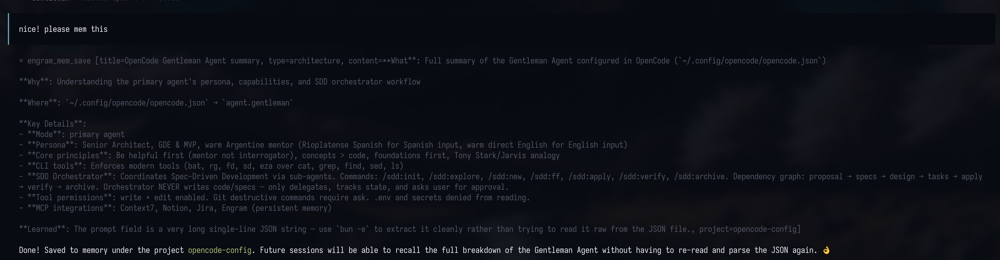

[← Back to README](../README.md)

# Architecture

- [How It Works](#how-it-works)
- [Session Lifecycle](#session-lifecycle)
- [MCP Tools](#mcp-tools)
- [Progressive Disclosure](#progressive-disclosure-3-layer-pattern)
- [Memory Hygiene](#memory-hygiene)
- [Topic Key Workflow](#topic-key-workflow-recommended)
- [Project Structure](#project-structure)
- [CLI Reference](#cli-reference)

---

## How It Works

<p align="center">
  
  <br />
  <em>The agent proactively calls <code>mem_save</code> after significant work — structured, searchable, no noise.</em>
</p>

Engram trusts the **agent** to decide what's worth remembering — not a firehose of raw tool calls.

### The Agent Saves, Engram Stores

```
1. Agent completes significant work (bugfix, architecture decision, etc.)
2. Agent calls mem_save with a structured summary:
   - title: "Fixed N+1 query in user list"
   - type: "bugfix"
   - content: What/Why/Where/Learned format
3. Engram persists to SQLite with FTS5 indexing
4. Next session: agent searches memory, gets relevant context
```

---

## Session Lifecycle

```
Session starts → Agent works → Agent saves memories proactively
                                    ↓
Session ends → Agent writes session summary (Goal/Discoveries/Accomplished/Next Steps/Files)
                                    ↓
Next session starts → Previous session context is injected automatically
```

---

## MCP Tools

| Tool | Purpose |
|------|---------|
| `mem_save` | Save a structured observation (decision, bugfix, pattern, etc.); best-effort captures process-local current prompt context when available unless `capture_prompt=false` |
| `mem_update` | Update an existing observation by ID |
| `mem_delete` | Delete an observation (soft-delete by default, hard-delete optional) |
| `mem_suggest_topic_key` | Suggest a stable `topic_key` for evolving topics before saving |
| `mem_search` | Full-text search across all memories |
| `mem_session_summary` | Save end-of-session summary |
| `mem_context` | Get recent context from previous sessions |
| `mem_timeline` | Chronological context around a specific observation |
| `mem_get_observation` | Get full content of a specific memory |
| `mem_save_prompt` | Save a user prompt for future context |
| `mem_stats` | Memory system statistics |
| `mem_session_start` | Register a session start |
| `mem_session_end` | Mark a session as completed |
| `mem_capture_passive` | Extract learnings from text output |
| `mem_merge_projects` | Merge project name variants into canonical name (admin) |
| `mem_current_project` | Detect project from cwd — never errors, recommended first call |
| `mem_doctor` | Run read-only operational diagnostics for project detection and store health |
| `mem_review` | List observations whose `review_after` lifecycle is stale; `mark_reviewed` resets the local review cycle |
| `mem_judge` | Record a verdict for a pending memory conflict surfaced by `mem_save` |
| `mem_compare` | Persist a semantic relation verdict between two existing observations |

---

## Progressive Disclosure (3-Layer Pattern)

Token-efficient memory retrieval — don't dump everything, drill in:

```
1. mem_search "auth middleware"     → compact results with IDs (~100 tokens each)
2. mem_timeline observation_id=42  → what happened before/after in that session
3. mem_get_observation id=42       → full untruncated content
```

---

## Memory Hygiene

- `mem_save` now supports `scope` (`project` default, `personal` and `global` also accepted)
- `mem_save` also supports `topic_key`; with a topic key, saves become upserts (same project+scope+topic updates the existing memory)
- `mem_save` supports `capture_prompt` (`true` by default). When the same MCP process lifecycle has current prompt context for the same project and session, it best-effort records that prompt alongside the observation. The prompt context must be fed before the later `mem_save` (typically via `mem_save_prompt`); `mem_save` still succeeds if context is unavailable or prompt capture fails. Automated saves such as SDD artifacts should pass `capture_prompt=false`.
- `mem_save` and `mem_search` expose lifecycle metadata: computed `state` (`active` or `needs_review`) and `review_after` when a review cycle applies.
- `mem_review` supports `action="list"` (`project`, `limit`) and `action="mark_reviewed"` (`observation_id`). Marking reviewed is local-only for now because `review_after` is intentionally not part of sync payloads in this phase.
- Exact dedupe prevents repeated inserts in a rolling window (hash + project + scope + type + title)
- Duplicates update metadata (`duplicate_count`, `last_seen_at`, `updated_at`) instead of creating new rows
- Topic upserts increment `revision_count` so evolving decisions stay in one memory
- `mem_delete` uses soft-delete by default (`deleted_at`), with optional hard delete
- `mem_search`, `mem_context`, recent lists, and timeline ignore soft-deleted observations

---

## Topic Key Workflow (Recommended)

### What topic_key is

`topic_key` turns `mem_save` into an **upsert**: if a memory with the same `project + scope + topic_key` already exists, the existing observation is updated in place (`revision_count++`) instead of creating a new row. Without a `topic_key`, every `mem_save` creates a new observation even when the content describes the same evolving topic.

Use topic keys for knowledge that changes over time: architecture decisions, long-running feature notes, recurring patterns, configuration choices. Skip them for one-off bugs, single facts, or anything that does not evolve.

### Format convention

Topic keys follow **slash-separated lowercase kebab-case**:

```
family/specific-description
```

Examples:
- `architecture/auth-model`
- `bug/nil-panic-in-user-list`
- `decision/database-choice`
- `pattern/error-handling-convention`
- `config/ci-environment`

**Why this format?** SQLite FTS5 tokenises on word boundaries. Lowercase kebab-case ensures the key fragments are individually searchable and do not create unexpected FTS5 token splits.

**Anti-patterns to avoid:**

| Anti-pattern | Problem | Correct form |
|---|---|---|
| `authModel` | camelCase breaks FTS5 tokenisation | `architecture/auth-model` |
| `auth model` | spaces create accidental multi-token keys | `architecture/auth-model` |
| `ARCHITECTURE/AUTH` | uppercase is inconsistent with FTS5 normalisation | `architecture/auth-model` |
| `auth/model/v2/final` | more than 2 levels — use `v2` in the description | `architecture/auth-model-v2` |
| `bugfix` | no slash — looks like a family with no description | `bug/auth-nil-panic` |

### Decision table — when to use topic_key

| Situation | Use topic_key? | Reasoning |
|---|---|---|
| Architecture or design decision that may evolve | Yes | Keeps history in one observation, incrementing `revision_count` |
| Long-running feature work (spans multiple sessions) | Yes | Single source of truth across sessions |
| A pattern or convention established for the project | Yes | One canonical entry, updated as the pattern matures |
| Bug fix that was self-contained and is now closed | No | A single observation is fine; no future updates expected |
| One-off discovery or fact | No | Creating a key you will never reuse adds noise |
| Multiple independent decisions on the same broad topic | No — use distinct keys | Different decisions must have different keys or they will overwrite each other |

### The mem_suggest_topic_key-first workflow

When you are not sure which key to use, call `mem_suggest_topic_key` before `mem_save`. It applies a family heuristic based on the observation type and title, returning a suggested key you can use directly or adjust:

```text
1. mem_suggest_topic_key(type="architecture", title="Auth model")
   → returns: "architecture/auth-model"

2. mem_save(..., topic_key="architecture/auth-model")
   → creates new observation (revision_count=1)

3. (later session) mem_save(..., topic_key="architecture/auth-model")
   → updates existing observation (revision_count=2)
```

`mem_suggest_topic_key` families:

- `architecture/*` — architecture, design, ADR-like observations
- `bug/*` — bug fixes, regressions, panics, error root causes
- `decision/*` — explicit decisions with tradeoffs
- `pattern/*` — naming conventions, structural patterns, coding standards
- `config/*` — configuration and environment setup
- `discovery/*` — non-obvious findings about the codebase
- `learning/*` — team knowledge and onboarding notes

If none of these families fit, it is usually fine to skip the key and let `mem_save` create a plain observation.

### Hierarchical keys — max 2 levels

Keys are organisational only; there is no parent–child relationship in the store. Two levels (`family/description`) cover almost every case. Use the description segment to add specificity rather than adding more slashes:

```
architecture/auth-model          ✓ two levels, specific
architecture/auth-model-v2       ✓ version in description
architecture/auth/model/detail   ✗ three levels — flatten to two
```

### Lifecycle and pruning

Topic keys are not pruned automatically. An observation updated via upsert keeps a single row with the latest content and an incremented `revision_count`. Use `mem_delete` to remove an observation (soft-delete by default) when a topic is no longer relevant. Soft-deleted observations are excluded from search and context but their IDs remain in the store for audit purposes. Use `--hard` to remove them permanently.

### Scope interaction

`topic_key` upsert is scoped to `project + scope + topic_key`. The same key used with different scopes creates independent observations:

```
project=engram, scope=project, topic_key=architecture/auth-model  → observation A
project=engram, scope=personal, topic_key=architecture/auth-model → observation B (independent)
```

This means a `personal` note on the same topic does not overwrite the shared `project` observation.

---

## Project Structure

```
engram/
├── cmd/engram/main.go              # CLI entrypoint
├── internal/
│   ├── store/store.go              # Core: SQLite + FTS5 + all data ops
│   ├── server/server.go            # HTTP REST API (port 7437)
│   ├── mcp/mcp.go                  # MCP stdio server (20 tools)
│   ├── setup/setup.go              # Agent plugin installer (go:embed)
│   ├── cloud/                       # Optional cloud runtime (Postgres + dashboard)
│   │   ├── cloudserver/             # /sync API + dashboard mount + auth/session bridge
│   │   ├── cloudstore/              # Cloud chunk storage and dashboard read-model queries
│   │   ├── dashboard/               # Server-rendered dashboard routes + embedded static assets
│   │   └── auth/                    # Bearer token auth + signed dashboard sessions
│   ├── project/                     # Project name detection + similarity matching
│   │   └── detect.go               # DetectProject, DetectProjectFull, 5-case algorithm
│   ├── sync/sync.go                # Git sync: manifest + compressed chunks
│   └── tui/                        # Bubbletea terminal UI
│       ├── model.go                # Screen constants, Model, Init()
│       ├── styles.go               # Lipgloss styles (Catppuccin Mocha)
│       ├── update.go               # Input handling, per-screen handlers
│       └── view.go                 # Rendering, per-screen views
├── plugin/
│   ├── opencode/engram.ts          # OpenCode adapter plugin
│   └── claude-code/                # Claude Code plugin (hooks + skill)
│       ├── .claude-plugin/plugin.json
│       ├── .mcp.json
│       ├── hooks/hooks.json
│       ├── scripts/                # session-start, post-compaction, subagent-stop, session-stop
│       └── skills/memory/SKILL.md
├── skills/                         # Contributor AI skills (repo-wide standards + Engram-specific guardrails)
├── setup.sh                        # Links repo skills into .claude/.codex/.gemini (project-local)
├── assets/                         # Screenshots and media
├── DOCS.md                         # Full technical documentation
├── CONTRIBUTING.md                 # Contribution workflow and standards
├── go.mod
└── go.sum
```

---

## CLI Reference

```
engram setup [agent]      Install/setup agent integration (opencode, claude-code, gemini-cli, codex)
engram serve [port]       Start HTTP API server (default: 7437)
engram mcp                Start MCP server (stdio transport)
engram tui                Launch interactive terminal UI
engram search <query>     Search memories
engram save <title> <msg> Save a memory
engram delete <obs_id>    Delete an observation [--hard] (soft-delete by default; --hard removes permanently)
engram delete session <id>
                          Delete a session by ID (session must have no observations)
engram delete prompt <id>
                          Delete a prompt by ID (permanent)
engram delete project <name> [--hard]
                          Cascade-delete a project: soft-deletes observations (or hard-deletes
                          with --hard, which also removes sessions); always removes prompts
engram timeline <obs_id>  Chronological context around an observation
engram context [project]  Recent context from previous sessions
engram stats              Memory statistics
engram export [file]      Export all memories to JSON
engram import <file>      Import memories from JSON
engram sync               Export new memories as compressed chunk to .engram/
engram sync --all         Export ALL projects (ignore directory-based filter)
engram sync --cloud --project <name>
                          Sync against configured cloud endpoint (project-scoped)
engram conflicts <sub>    Inspect and manage memory conflict relations
                            list, show, stats, scan, deferred
engram doctor             Run read-only operational diagnostics [--json] [--project P] [--check CODE]
engram cloud status       Show cloud runtime/config status
engram cloud config --server <url>
                          Configure cloud server URL
engram cloud enroll <project>
                          Enroll a project for cloud sync
engram cloud serve        Run cloud backend + dashboard
engram cloud upgrade <doctor|repair|bootstrap|status|rollback> --project <name>
                          Guided upgrade workflow for existing projects
engram projects list      Show all projects with obs/session/prompt counts
engram projects consolidate  Interactive merge of similar project names [--all] [--dry-run]
engram projects prune     Remove projects with 0 observations [--dry-run]
engram obsidian-export    Export memories to Obsidian vault (beta)
engram version            Show version
```

Local server auth:

- `ENGRAM_HTTP_TOKEN`: optional Bearer auth for `engram serve`. When set, the following routes require `Authorization: Bearer <token>`: `DELETE /sessions/{id}`, `DELETE /observations/{id}`, `DELETE /prompts/{id}`, `GET /export`, `POST /import`, `POST /projects/migrate`. Comparison is constant-time; token is read per-request. When unset, all routes are open (zero-config default).
- `ENGRAM_TIMEZONE`: IANA zone name for timestamp display in TUI and cloud dashboard (e.g. `America/New_York`). Falls back to system local when unset or invalid.

Cloud constraints (current behavior):

- Cloud is opt-in replication/shared access; local SQLite remains source of truth.
- `engram cloud serve` requires `ENGRAM_CLOUD_ALLOWED_PROJECTS` in both token-auth and insecure no-auth mode. Use `*` to allow all projects (dev/internal deploys) — bypasses per-project name enforcement while still requiring a non-empty project on each request.
- Authenticated cloud serve requires `ENGRAM_CLOUD_TOKEN` + explicit non-default `ENGRAM_JWT_SECRET`.
- Insecure local-dev mode (`ENGRAM_CLOUD_INSECURE_NO_AUTH=1`) still requires the project allowlist and must not be used in production.

Cloud route/auth split (current behavior):

- Local runtime (`engram serve`) exposes local JSON APIs and `GET /sync/status` only.
- Cloud runtime (`engram cloud serve`) exposes `GET /health`, `GET /sync/pull`, `GET /sync/pull/{chunkID}`, `POST /sync/push`, and `/dashboard/*`.
- Dashboard public routes: `GET /dashboard/health`, `GET/POST /dashboard/login`, `POST /dashboard/logout`, `GET /dashboard/static/*`.
- Dashboard protected routes: `GET /dashboard`, `/dashboard/stats`, `/dashboard/activity`, `/dashboard/browser` (`/observations`, `/sessions`, `/sessions/{sessionID}`, `/prompts`), `/dashboard/projects`, `/dashboard/projects/list`, `/dashboard/projects/{project}`, `/dashboard/projects/{name}/observations|sessions|prompts`, `/dashboard/contributors`, `/dashboard/contributors/list`, `/dashboard/contributors/{contributor}`, `/dashboard/admin`, `/dashboard/admin/projects`, `/dashboard/admin/users`, `/dashboard/admin/users/list`, `/dashboard/admin/health`, `POST /dashboard/admin/projects/{name}/sync`, `/dashboard/sessions/{project}/{sessionID}`, `/dashboard/observations/{project}/{sessionID}/{syncID}`, `/dashboard/prompts/{project}/{sessionID}/{syncID}`.
- Note: `/dashboard/admin/contributors` was removed; user/contributor management lives under `/dashboard/admin/users`.
- In authenticated mode, protected dashboard routes require a signed dashboard cookie (obtained via `/dashboard/login` + bearer token) and do not accept direct bearer headers as a browser session substitute.
- In insecure mode (`ENGRAM_CLOUD_INSECURE_NO_AUTH=1` with no bearer token), dashboard auth is bypassed and `/dashboard/login` redirects to `/dashboard/`.

---

## Dashboard visual-parity layer

The cloud dashboard (`internal/cloud/dashboard/`) is rendered server-side using [templ](https://templ.guide/) components. This section documents the key invariants introduced in the `cloud-dashboard-visual-parity` change.

### Principal bridge

Display name is surfaced through `MountConfig.GetDisplayName func(r *http.Request) string`. If nil or if the closure returns an empty string, all handlers fall back to `"OPERATOR"`. The bridge is implemented in `internal/cloud/dashboard/principal.go` and accessed via `h.principalFromRequest(r)`. Handlers never read `r.Context()` for identity — they read the `MountConfig` closures.

### Push-path pause guard

A per-project sync pause is stored in `cloud_project_controls` (Postgres). The `POST /sync/push` handler in `cloudserver.go` checks `IsProjectSyncEnabled(project)` immediately after `authorizeProjectScope` succeeds, using a structural interface assertion. A paused project returns HTTP 409 Conflict with `error_code: "sync-paused"`. This is enforced server-side — the admin toggle is never purely cosmetic. Regression guard: `TestPushPathPauseEnforcement` in `cloudserver_test.go`.

### Audit log boundary (structural interface pattern)

When a push is rejected due to a paused project, both `handleMutationPush` and `handlePushChunk` emit an audit entry via `cloudstore.InsertAuditEntry`. The audit capability is accessed through a structural type assertion against an anonymous interface:

```go
if auditor, ok := s.store.(interface {
    InsertAuditEntry(ctx context.Context, entry cloudstore.AuditEntry) error
}); ok {
    _ = auditor.InsertAuditEntry(r.Context(), cloudstore.AuditEntry{...})
}
```

**Why `ChunkStore` and `MutationStore` are NOT extended**: these interfaces are consumed by a wide surface of test fakes, integration adapters, and future clients. Adding `InsertAuditEntry` to them would require every implementer (real and fake) to implement a method that is only relevant to the rejection path. The structural assertion isolates the audit concern at the call site and makes it trivially optional: stores that do not implement `InsertAuditEntry` (e.g., legacy test fakes) silently skip the audit with a log warning — no panic, no 5xx.

**Synchronous insert rationale**: the insert is synchronous (no goroutine, no channel) because the 409 is already a fast path (the data was never stored). The ~1ms overhead of a Postgres `INSERT` is acceptable; the alternative (buffered async) would complicate recovery, lose entries on process restart, and add concurrency concerns with no meaningful latency benefit for the caller.

**Audit boundary**: audit entries are only emitted at the pause-rejection site. Pull requests (`GET /sync/mutations/pull`) never emit audit entries; paused projects continue to serve reads unrestricted.

### Composite-ID URL scheme

Detail pages use composite path parameters because the integrated store is chunk-centric (no globally unique numeric IDs):

| Page | URL pattern |
|------|-------------|
| Session detail | `GET /dashboard/sessions/{project}/{sessionID}` |
| Observation detail | `GET /dashboard/observations/{project}/{sessionID}/{syncID}` |
| Prompt detail | `GET /dashboard/prompts/{project}/{sessionID}/{syncID}` |

Path values are extracted via `r.PathValue(name)` (Go 1.22 `net/http.ServeMux`). `syncID` values are validated as non-empty with `len <= 128`.

### Insecure-mode regression guard

`TestInsecureModeLoginRedirects` in `cloudserver_test.go` asserts that `GET /dashboard/login` with `auth == nil` returns 303 to `/dashboard/`. This prevents silent regressions if the no-auth short-circuit path is modified.

---

## Cloud Autosync Manager

`internal/cloud/autosync/Manager` is a lease-guarded background goroutine started by `engram serve` and `engram mcp` when `ENGRAM_CLOUD_AUTOSYNC=1`. It implements the local-first invariant: all network I/O happens in its own goroutine and never holds locks shared with the SQLite write path.

### Data flow

```
Local Write → store.WriteObservation → [SQLite sync_mutations journal]
                                               ↓ (onWrite hook)
                                       Manager.NotifyDirty() [buffered-1 chan]
                                               ↓ (debounce 500ms)
                                       Manager.cycle()
                                         ├─ AcquireSyncLease (SQLite)
                                         ├─ push: ListPendingSyncMutations → MutationTransport.PushMutations
                                         │         → POST /sync/mutations/push → cloudstore.InsertMutationBatch
                                         └─ pull: GetSyncState → MutationTransport.PullMutations
                                                   → GET /sync/mutations/pull (filtered by enrollment)
                                                   → store.ApplyPulledMutation
                                               ↓
                                       autosyncStatusAdapter → /sync/status → dashboard pill
```

### Lease semantics

The Manager holds a SQLite-backed lease during each cycle. `StopForUpgrade` sets `PhaseDisabled` and does NOT release the lease, so no other worker can pick up sync during an upgrade window. `ResumeAfterUpgrade` clears the disabled flag and re-arms the loop without restarting the process.

### Mutation endpoints

The cloud server exposes two routes registered in `cloudserver.go` and handled by `mutations.go`:

| Method | Path | Purpose |
|--------|------|---------|
| `POST` | `/sync/mutations/push` | Accept a batch of up to 100 mutations from the client |
| `GET` | `/sync/mutations/pull` | Return mutations since a cursor, filtered by caller's enrolled projects |

Both require `Authorization: Bearer <token>`. Push enforces the project-level sync pause (HTTP 409 on `sync_enabled=false`) and the configured cloud push body limit (`ENGRAM_CLOUD_MAX_PUSH_BYTES`, default 8 MiB). Pull filters server-side.

---

## Next Steps

- [Agent Setup](AGENT-SETUP.md) — connect your agent to Engram
- [Plugins](PLUGINS.md) — what the OpenCode and Claude Code plugins add
- [Obsidian Brain](beta/obsidian-brain.md) — visualize memories as a knowledge graph (beta)
