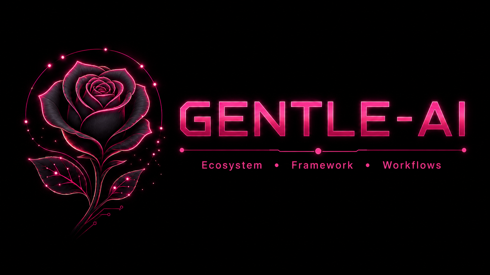

<div align="center">



<h1>Gentle-AI</h1>

<p><strong>Gentle-AI — Ecosystem, Frameworks, Workflows for AI coding agents.</strong></p>

<p>
<a href="https://github.com/Gentleman-Programming/gentle-ai/releases"></a>
<a href="LICENSE"></a>


</p>

</div>

---

## What It Does

Gentle-AI is NOT an AI agent installer. Most agents are easy to install. It is an **ecosystem configurator** -- it takes whatever AI coding agent(s) you use and supercharges them with persistent memory, Spec-Driven Development workflows, curated coding skills, MCP servers, an AI provider switcher, a teaching-oriented persona with security-first permissions, and per-phase model assignment so each SDD step can run on a different model.

**Before**: "I installed Claude Code / OpenCode / Cursor, but it's just a chatbot that writes code."

**After**: Your agent now has memory, skills, workflow, MCP tools, and a persona that actually teaches you.

### 15 Supported Agents

| Agent               |         Delegation Model         | Key Feature                                                     |
| ------------------- | :------------------------------: | --------------------------------------------------------------- |
| **Claude Code**     |         Full (Task tool)         | Sub-agents, output styles                                       |
| **OpenCode**        |    Full (multi-mode overlay)     | Per-phase model routing                                         |
| **Kilo Code**       |    Full (multi-mode overlay)     | OpenCode-compatible config in `~/.config/kilo`                  |
| **Gemini CLI**      |       Full (experimental)        | Custom agents in `~/.gemini/agents/`                            |
| **Cursor**          |     Full (native subagents)      | 10 SDD agents in `~/.cursor/agents/`                            |
| **VS Code Copilot** |        Full (runSubagent)        | Parallel execution                                              |
| **Codex**           |            Solo-agent            | CLI-native, TOML config                                         |
| **Windsurf**        |            Solo-agent            | Plan Mode, Code Mode, native workflows                          |
| **Antigravity**     |   Solo-agent + Mission Control   | Built-in Browser/Terminal sub-agents                            |
| **Kimi Code**       |   Full (native custom agents)    | Modular prompt templates in `~/.kimi`                           |
| **Kiro IDE**        |     Full (native subagents)      | Native `~/.kiro/agents/` + steering orchestration               |
| **Qwen Code**       |     Full (native sub-agents)     | Slash commands, `~/.qwen/commands/`, `auto_edit` mode           |
| **OpenClaw**        |            Solo-agent            | Workspace-first `AGENTS.md` / `SOUL.md` with global MCP config  |
| **Trae**            |            Solo-agent            | Desktop app by ByteDance; `~/.trae/skills/` + OS-specific rules |
| **Pi**              | Full (package-managed subagents) | `gentle-pi` harness with persona/model commands + Engram memory |
| **Hermes**          |         Detect-only              | YAML MCP config, SOUL.md persona; install manually first        |

> **Note**: This project supersedes [Agent Teams Lite](https://github.com/Gentleman-Programming/agent-teams-lite) (now archived). Everything ATL provided is included here with better installation, automatic updates, and persistent memory.

### Delegation Triggers

Gentle-AI keeps the parent/orchestrator thread thin. Once a task stops being small, delegation or an explicit SDD phase boundary is expected rather than optional.

| Trigger                                                                    | Expected behavior                                         |
| -------------------------------------------------------------------------- | --------------------------------------------------------- |
| Reading 4+ files to understand a flow                                      | Delegate exploration or run an exploration phase.         |
| Touching 2+ non-trivial files                                              | Use one writer or require fresh review before completion. |
| Commit, push, or PR after code changes                                     | Run fresh review unless the diff is trivial docs/text.    |
| Wrong cwd, worktree/git accident, merge recovery, confusing test/env issue | Stop and run a fresh audit before continuing.             |
| Long monolithic session with accumulating complexity                       | Pause and delegate, re-plan, or justify why not.          |
| Adversarial review of diffs, conflicts, PR readiness, or incidents         | Use fresh context when the agent platform supports it.    |

The goal is not ceremony. The goal is to avoid accidental chaos while preserving one responsible orchestrator and one writer thread.

---

## Quick Start

### macOS / Linux

```bash
curl -fsSL https://raw.githubusercontent.com/Gentleman-Programming/gentle-ai/main/scripts/install.sh | bash
```

### Windows

```powershell
scoop bucket add gentleman https://github.com/Gentleman-Programming/scoop-bucket
scoop install gentle-ai
```

### Try the beta channel (test `main` before a release)

The beta channel builds Gentle AI straight from `main`, so you need **Go 1.24+** installed first. Use it to try unreleased changes and report issues early.

**macOS / Linux**

```bash
curl -fsSL https://raw.githubusercontent.com/Gentleman-Programming/gentle-ai/main/scripts/install.sh | bash -s -- --channel beta
```

**Windows (PowerShell)**

```powershell
$env:GENTLE_AI_CHANNEL="beta"; irm https://raw.githubusercontent.com/Gentleman-Programming/gentle-ai/main/scripts/install.ps1 | iex
```

To keep upgrading on beta later, run `GENTLE_AI_CHANNEL=beta gentle-ai upgrade`. To return to stable, reinstall via Homebrew or Scoop.

### After install: project-level setup

Once your agents are configured, open your AI agent in a project and run these two commands to register the project context:

| Command                            | What it does                                                                | When to re-run                                                                 |
| ---------------------------------- | --------------------------------------------------------------------------- | ------------------------------------------------------------------------------ |
| `/sdd-init`                        | Detects stack, testing capabilities, activates Strict TDD Mode if available | When your project adds/removes test frameworks, or first time in a new project |
| `gentle-ai skill-registry refresh` | Scans installed skills and project conventions, builds the registry         | After installing/removing skills, or first time in a new project               |

These are **not required** for basic usage. The SDD orchestrator runs `/sdd-init` automatically if it detects no context. Startup hooks normally keep the skill registry fresh for agents that support hooks, including Codex, Claude Code, OpenCode, and Pi through `gentle-pi`. If you start Pi with `pi -ns`, startup skill loading/hooks are skipped, so run the registry refresh manually when you need updated project rules.

Run `gentle-ai doctor` at any time for a read-only health check of your ecosystem (tool binaries, `state.json`, Engram reachability, disk space).

---

## Install

### Recommended

```bash
# macOS / Linux
brew tap Gentleman-Programming/homebrew-tap
brew trust --formula gentleman-programming/tap/gentle-ai  # one-time, for Homebrew tap trust
brew install gentle-ai

# Windows
scoop bucket add gentleman https://github.com/Gentleman-Programming/scoop-bucket
scoop install gentle-ai
```

<details>
<summary><strong>Other install methods</strong> (Go install)</summary>

#### Go install (any platform with Go 1.24+)

```bash
go install github.com/gentleman-programming/gentle-ai/cmd/gentle-ai@latest
```

#### Windows

Use Scoop on Windows. It is the supported install path for keeping Gentle AI updated cleanly:

```powershell
scoop bucket add gentleman https://github.com/Gentleman-Programming/scoop-bucket
scoop install gentle-ai
```

</details>

By default, `gentle-ai install` writes agent-scoped files to each selected agent's global config directory. To keep the Gentleman stack isolated to one project, run:

```bash
gentle-ai install --scope=workspace
```

Workspace scope is not Claude-only; it applies to selected agents for agent-scoped files such as system prompts, skills, SDD agents, and persona files. Global-only integrations remain global by design.

---

## Backups

Every install, sync, and upgrade automatically snapshots your config files. Backups are **compressed** (tar.gz), **deduplicated** (identical configs are not re-backed up), and **auto-pruned** (keeps the 5 most recent). Pin important backups via the TUI (`p` key) to protect them from pruning.

See [Backup & Rollback Guide](docs/rollback.md) for details.

---

## Key Features You Should Know About

### OpenCode SDD Profiles

Assign different AI models to different SDD phases -- a powerful model for design, a fast one for implementation, a cheap one for exploration. OpenCode uses **`gentle-orchestrator`** as the base SDD conductor, and generated named profiles still appear as `sdd-orchestrator-{name}` entries.

```bash
# Via CLI
gentle-ai sync --profile cheap:openrouter/qwen/qwen3-30b-a3b:free
gentle-ai sync --profile-phase cheap:sdd-design:anthropic/claude-sonnet-4-20250514

# Or via TUI: gentle-ai → "OpenCode SDD Profiles" → Create
```

After creating a profile, open OpenCode and press **Tab** to switch between `gentle-orchestrator` (default) and your custom profiles.

| What you need         | Use this                                                        |
| --------------------- | --------------------------------------------------------------- |
| Default SDD conductor | `gentle-orchestrator`                                           |
| Legacy configs        | `sdd-orchestrator` is migrated to `gentle-orchestrator` on sync |
| Named model profiles  | `sdd-orchestrator-cheap`, `sdd-orchestrator-premium`, etc.      |

**Full guide**: [OpenCode SDD Profiles](docs/opencode-profiles.md)

### Engram (Persistent Memory)

Your AI agent automatically remembers decisions, bugs, and context across sessions. You don't need to do anything -- but when you do:

```bash
engram projects list          # See all projects with memory counts
engram projects consolidate   # Fix name drift ("my-app" vs "My-App")
engram search "auth bug"      # Find a past decision from the terminal
engram tui                    # Visual memory browser
```

**Full reference**: [Engram Commands](docs/engram.md)

---

## Documentation

| Topic                                              | Description                                                                             |
| -------------------------------------------------- | --------------------------------------------------------------------------------------- |
| [Intended Usage](docs/intended-usage.md)           | How Gentle-AI is meant to be used — the mental model                                    |
| [OpenCode SDD Profiles](docs/opencode-profiles.md) | Create and manage per-phase model profiles for OpenCode                                 |
| [Engram Commands](docs/engram.md)                  | CLI commands, MCP tools, project management, team sharing                               |
| [Codebase Guide](docs/CODEBASE-GUIDE.md)           | Maintainer map for repository ownership, architecture boundaries, and review guardrails |
| [Agents](docs/agents.md)                           | Supported agents, feature matrix, config paths, and per-agent notes                     |
| [Skill Registry](docs/skill-registry.md)           | Index-first skill discovery flow, delegation contract, and usage diagrams              |
| [Pi Agent](docs/pi.md)                             | Pi package stack, commands, persona, model assignment, and troubleshooting              |
| [Components, Skills & Presets](docs/components.md) | All components, GGA behavior, skill catalog, and preset definitions                     |
| [Usage](docs/usage.md)                             | Persona modes, interactive TUI, CLI flags, and dependency management                    |
| [Backup & Rollback](docs/rollback.md)              | Backup retention, compression, dedup, pinning, and restore                              |
| [Kiro IDE](docs/kiro.md)                           | Kiro-specific setup, config paths, native subagents, and SDD behavior                   |
| [Platforms](docs/platforms.md)                     | Supported platforms, Windows notes, security verification, config paths                 |
| [Architecture & Development](docs/architecture.md) | Codebase layout, testing, and relationship to Gentleman.Dots                            |

---

## Community Highlights

This project gets better when the community builds on top of it.

### Community Integrations

- [sub-agent-statusline](https://github.com/Joaquinvesapa/sub-agent-statusline) — optional OpenCode TUI plugin that shows sub-agent activity, status, elapsed time, and token/context usage when OpenCode exposes it.
- [sdd-engram-plugin](https://github.com/j0k3r-dev-rgl/sdd-engram-plugin) — optional OpenCode TUI plugin to manage SDD profiles and browse Engram memories directly from OpenCode, with runtime profile activation and no restart required.

When you select OpenCode in the installer, Gentle-AI asks whether to register each community plugin and offers a browser shortcut to review the repository first. Gentle-AI only ensures `~/.config/opencode/tui.json` exists and adds the plugin package names to its `plugin` array; OpenCode installs/loads those packages the next time it starts. Once OpenCode has materialized a plugin under `~/.config/opencode/node_modules/`, `gentle-ai update` can compare its local `package.json` version with the plugin's GitHub releases.

## Contributors

This project exists because of the community. See [CONTRIBUTORS.md](CONTRIBUTORS.md) for the full list.

<a href="https://github.com/Gentleman-Programming/gentle-ai/graphs/contributors">
  
</a>

---

## Next Steps

- **Just installed?** Read [Intended Usage](docs/intended-usage.md) -- the one page that explains the mental model.
- **Using OpenCode?** Set up [SDD Profiles](docs/opencode-profiles.md) to assign different models per phase.
- **Using Pi?** Read [Pi Agent](docs/pi.md) for Pi commands, persona, model assignments, and package behavior.
- **Want to share memory across machines?** Learn `engram sync` in the [Engram reference](docs/engram.md).
- **Ready to contribute?** Check [CONTRIBUTING.md](CONTRIBUTING.md) and the [open issues](https://github.com/Gentleman-Programming/gentle-ai/issues?q=is%3Aissue+is%3Aopen+label%3A%22status%3Aapproved%22).

---

<div align="center">
<a href="LICENSE"></a>
</div>
