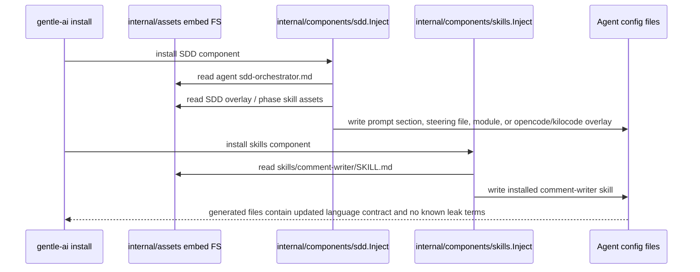
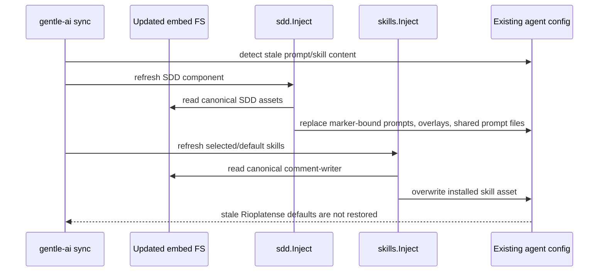
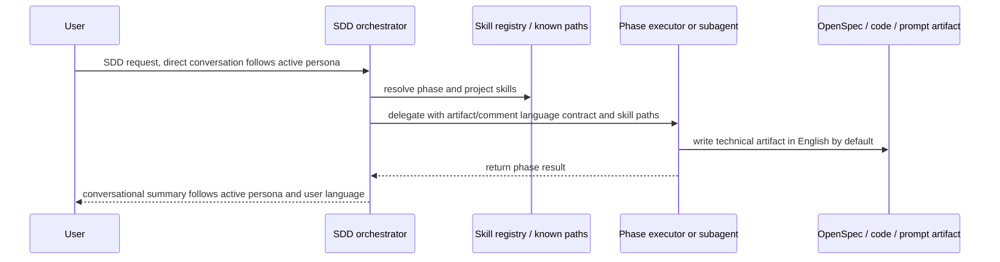

# Design: fix-persona-artifact-language-contract

## TL;DR

Make the language boundary explicit at the asset layer, then prove installation, sync, overlays, shared prompts, delegated prompts, and duplicated skill sources all preserve it. Direct conversation remains persona-governed, generated technical artifacts default to English, Spanish artifacts/comments default to neutral professional Spanish unless explicitly regional, and `comment-writer` follows the target context language.

This is a prompt-and-test change centered on `internal/assets`, `internal/components/sdd`, `internal/components/skills`, and CLI install/sync regression coverage. No runtime model/API semantics are expected to change.

---

## Architecture Decisions

### ADR 1 — Treat the language contract as an embedded asset invariant

**Decision.** Codify the three-domain language contract directly in embedded SDD orchestrator assets and SDD phase/delegation prompt surfaces, then guard those assets with tests.

**Rationale.** The observed leak is content-driven (`elegí`, `Respondé`, `¿Querés ajustar algo o continuamos?`) and can reappear through any install/sync path that reads stale embedded text. Making the contract an embedded-asset invariant keeps the source of truth where installation and sync already read from.

**Alternatives considered.** Runtime filtering of generated prompts was rejected because it would be fragile, harder to explain, and could accidentally remove legitimate Gentleman direct-conversation wording.

### ADR 2 — Keep persona voice, artifact language, and comment language as separate domains

**Decision.** Prompt assets must name three separate domains:

| Domain | Source of behavior | Default |
|--------|--------------------|---------|
| Direct conversation | Active persona | Gentleman may use Rioplatense Spanish; neutral does not. |
| Generated technical artifacts | Artifact contract | English, regardless of persona or conversation language. |
| Public/contextual comments | Target context plus explicit user override | Match target context language; Spanish is neutral/professional unless regional signal exists. |

**Rationale.** This prevents the Gentleman persona from being weakened while stopping it from crossing the artifact boundary. It also avoids over-correcting comments into always-English technical artifacts.

### ADR 3 — Normalize SDD assets broadly, not just OpenCode

**Decision.** Update and test all supported SDD orchestrator assets, including OpenCode/Kilocode, Claude, Kimi, Codex, Gemini, Qwen, Cursor, Windsurf, Antigravity, Kiro, generic fallback, and any newly discovered supported agent-specific asset.

**Rationale.** OpenCode has the known leak, but duplicated prompt families mean a one-file fix would leave hidden drift. The asset matrix becomes the review checklist and the test fixture input.

### ADR 4 — Use scoped guards with allowlists instead of a repository-wide word ban

**Decision.** Ban known leak terms and regional imperatives only in persona-agnostic SDD/comment surfaces. Allow intentional Rioplatense/voseo wording in Gentleman direct-conversation persona or output-style assets and in explicit regression documentation that names prohibited leaks.

**Rationale.** A repository-wide ban would produce false positives and could erase valid persona documentation. Scoped guards protect the contract without muting Gentleman.

### ADR 5 — Root and embedded `comment-writer` should share required rules, not necessarily byte-for-byte content

**Decision.** Update the root `skills/comment-writer/SKILL.md` to match the embedded skill's language behavior, and add a consistency test for required rules:

- context-reactive target language,
- explicit user override wins,
- neutral/professional Spanish by default,
- no forced Rioplatense/voseo for all Spanish comments.

Byte-for-byte equality is optional and should only be used if current examples/frontmatter can remain intentionally identical.

**Rationale.** The embedded asset is what install/sync writes, while the root skill is what repo-local agents may load. Both must be behaviorally aligned, but examples may legitimately differ over time.

### ADR 6 — Delegation forwarding belongs in orchestrator and executor prompt surfaces

**Decision.** Every SDD delegation path must forward the artifact/comment contract to phase executors or subagents. This includes native subagents, dynamic subagents, inline phase contexts, OpenCode shared prompt files, and placeholder-inlined overlays.

**Rationale.** The orchestrator may understand the contract, but delegated agents write the artifacts. If the contract is not forwarded, artifacts can still inherit persona style indirectly.

---

## Data Flow

### Install flow

### Sync flow

### Delegation flow

---

## Affected Files and Packages

| Area | Planned impact |
|------|----------------|
| `internal/assets/*/sdd-orchestrator.md` | Primary prompt wording changes for contract, preflight localization cleanup, delegation forwarding, and known leak removal. |
| `internal/assets/opencode/sdd-overlay-single.json` / `sdd-overlay-multi.json` | Ensure executor prompts or placeholder/shared prompt references forward the contract where needed. |
| `internal/assets/skills/comment-writer/SKILL.md` | Embedded installed skill contract. May need wording/examples updates to make neutral Spanish explicit. |
| `skills/comment-writer/SKILL.md` | Root in-repo skill contract aligned with embedded behavior. |
| `internal/assets/skills/_shared/*` and `internal/assets/skills/sdd-*/SKILL.md` | Candidate shared location for phase artifact-language reminders if needed, especially for shared prompt generation. |
| `internal/components/sdd` | Tests for asset selection, OpenCode/Kilocode overlay inlining, shared prompt files, preserved prompt migration, install/sync output inspection. Runtime code changes only if existing prompt construction cannot forward the contract from assets alone. |
| `internal/components/skills` | Tests that installed `comment-writer` comes from corrected embedded source and does not force regional Spanish. |
| `internal/components/persona` | Tests/wording to preserve Gentleman direct conversation while proving persona does not define artifact language. |
| `internal/cli` | Install/sync integration tests covering stale content refresh and multi-component propagation. |
| `internal/agents` / `internal/model` | No model/API change expected. Used for coverage enumeration and fallback checks. |
| `testdata/golden` | Mechanical golden updates for generated prompt/skill outputs touched by install/sync tests. |

---

## All-Agent Matrix

| Agent ID | SDD asset source | Install surface | Delegation/prompt risk | Required coverage |
|----------|------------------|-----------------|------------------------|-------------------|
| `claude-code` | `internal/assets/claude/sdd-orchestrator.md` | Markdown section in `CLAUDE.md` plus Claude commands/agents | Native Agent/Task prompts must forward contract without OpenCode persistence claims | Asset guard, install/sync output, delegation wording |
| `opencode` | `internal/assets/opencode/sdd-orchestrator.md` | `opencode.json` `gentle-orchestrator` prompt plus commands, overlays, shared prompts | Known leak path; overlay inlining and shared prompt files can regenerate stale wording | Strongest regression coverage, including exact banned terms |
| `kilocode` | OpenCode SDD asset path | Kilocode settings using OpenCode-compatible overlay behavior | Same known leak path via OpenCode asset reuse | Explicit install/sync test or shared helper case |
| `gemini-cli` | `internal/assets/gemini/sdd-orchestrator.md` | File-replace prompt asset plus OpenCode-compatible commands | Generic prompt delegation must forward contract | Asset guard and install/sync smoke |
| `cursor` | `internal/assets/cursor/sdd-orchestrator.md` | File-replace prompt plus Cursor agents | Cursor phase agent prompts can miss forwarded artifact rule | Asset guard plus phase-agent wording check if agents contain phase prompts |
| `vscode-copilot` | `internal/assets/generic/sdd-orchestrator.md` | Instructions file | Generic fallback drift | Generic fallback guard and install output |
| `codex` | `internal/assets/codex/sdd-orchestrator.md` | File-replace prompt | Prompt-only delegation wording | Asset guard and install output |
| `antigravity` | `internal/assets/antigravity/sdd-orchestrator.md` | Append prompt | Dynamic `define_subagent` / `invoke_subagent` context can omit contract | Asset guard with dynamic subagent forwarding assertion |
| `windsurf` | `internal/assets/windsurf/sdd-orchestrator.md` | Append prompt | Solo-agent inline phase context can omit contract | Asset guard with inline phase context assertion |
| `kimi` | `internal/assets/kimi/sdd-orchestrator.md` plus `KIMI.md` include | Jinja module under Kimi config | Custom-agent prompt and Kimi skills path forwarding | Asset guard plus module/install check |
| `qwen-code` | `internal/assets/qwen/sdd-orchestrator.md` | File-replace prompt | Prompt-only delegation wording | Asset guard and install output |
| `kiro-ide` | `internal/assets/kiro/sdd-orchestrator.md` | Steering file | Kiro phase context and approval flow can omit contract | Asset guard with Kiro phase-context assertion |
| `openclaw` | Expected fallback is `internal/assets/generic/sdd-orchestrator.md`, but current markdown-section injector hardcodes `internal/assets/claude/sdd-orchestrator.md` | Markdown section in workspace/global prompt | Asset-selection mismatch can make generic tests pass while install output uses Claude wording | Asset-selection/install guard and implementation decision if mismatch is confirmed |
| `pi` | `internal/assets/generic/sdd-orchestrator.md` | Append prompt | Generic fallback drift | Generic fallback guard |
| `trae-ide` | Expected fallback is `internal/assets/generic/sdd-orchestrator.md`, but current markdown-section injector hardcodes `internal/assets/claude/sdd-orchestrator.md` | User rules markdown section | Same markdown-section mismatch as OpenClaw | Asset-selection/install guard and implementation decision if mismatch is confirmed |
| Unknown future supported agent | `internal/assets/generic/sdd-orchestrator.md` unless dedicated asset added; verify markdown-section adapters do not accidentally receive Claude-only wording | Adapter-defined | New asset can be skipped by hand-maintained lists | Coverage test that enumerates supported/dedicated SDD assets from asset registry expectations |

---

## OpenCode/Kilocode Overlay and Shared Prompt Risks

| Risk | Where it appears | Design response |
|------|------------------|-----------------|
| Known Spanish preflight leak remains in embedded OpenCode asset | `internal/assets/opencode/sdd-orchestrator.md` and preserved prompt migration text in `internal/components/sdd/inject.go` | Replace voseo examples with neutral/professional Spanish and update migration helper tests. |
| `PreserveOpenCodeOrchestratorPrompt` migrates old content but keeps stale language | `migratePreservedOpenCodeOrchestratorPrompt` / `ensurePreservedOpenCodeOrchestratorPreflight` | Add a stale-prompt regression: preserved old prompt is migrated to neutral contract and banned terms are absent. |
| Multi-mode writes shared prompt files from embedded SDD skills | `WriteSharedPromptFiles` reads `internal/assets/skills/sdd-*/SKILL.md` | Put contract in shared SDD skill/common text or overlay executor prompts so shared prompt files inherit it. Test written files directly. |
| Overlay placeholders hide actual phase prompt content from JSON assertions | `inlineOpenCodeSDDPrompts` changes placeholders to `{file:...}` | Tests must inspect both merged JSON and referenced prompt files. |
| Kilocode silently reuses OpenCode asset behavior | Kilocode adapter settings path with OpenCode-compatible overlay | Include Kilocode as a named case, not only as implied OpenCode coverage. |

---

## Skill Source Duplication Strategy

1. Treat `internal/assets/skills/comment-writer/SKILL.md` as the installed source of truth.
2. Treat root `skills/comment-writer/SKILL.md` as the repo-local authoring/agent source that must satisfy the same behavioral contract.
3. Add tests that read both files and assert shared required phrases or normalized rule semantics.
4. Prefer behavioral consistency over byte-for-byte equality unless examples/frontmatter can be kept identical without reducing clarity.
5. Include negative assertions that neither file forces `Rioplatense`, `voseo`, `podés`, `tenés`, `fijate`, or `dale` as the default for all Spanish comments. Allow those terms only when explicitly framed as non-default/regional examples.

---

## Strict TDD Test Strategy

Follow `openspec/config.yaml` strict TDD: write failing tests first, then edit assets/code, then update goldens only after behavior tests pass.

### Phase 1 — Failing characterization tests

1. Add asset-level guard tests in `internal/assets/assets_test.go`:
   - all persona-agnostic SDD orchestrator assets include the artifact/comment contract,
   - known leak terms are absent from persona-agnostic SDD assets,
   - Gentleman persona/output-style assets remain allowed to mention Rioplatense/voseo for direct conversation.
2. Add `comment-writer` source consistency tests for root and embedded skill files.
3. Add OpenCode/Kilocode install tests proving neutral persona + SDD + skills output contains no banned leak terms and installs corrected `comment-writer`.
4. Add sync tests with stale content pre-seeded in prompt/skill files.
5. Add multi-mode shared prompt tests inspecting generated prompt files and merged overlay references.
6. Add delegation-forwarding assertions per supported orchestrator family.

These tests should fail on the current repository because OpenCode and migration text contain known leak terms and the root `comment-writer` forces Rioplatense Spanish.

### Phase 2 — Minimal implementation after red tests

1. Normalize SDD orchestrator assets and preserved preflight migration text.
2. Update root and embedded `comment-writer` wording as needed.
3. Add shared SDD skill/common wording only if shared prompt file tests prove executor prompts need it.
4. Update tests that currently require old Spanish strings to require neutral alternatives.

### Phase 3 — Golden and full verification

1. Regenerate only affected golden fixtures.
2. Run targeted packages first:
   - `go test ./internal/assets/...`
   - `go test ./internal/components/sdd/...`
   - `go test ./internal/components/skills/...`
   - `go test ./internal/cli/...`
3. Run required full verification:
   - `go test ./...`
   - `go vet ./...`
4. Compare implementation against every scenario in `openspec/changes/fix-persona-artifact-language-contract/spec.md`.

---

## Review Workload and Rollout

This change is likely broad because prompt assets and golden fixtures are duplicated across agent families.

| Workload risk | Mitigation |
|---------------|------------|
| User budget for this session is 1000 changed lines, but repo CI/review policy may enforce 400 changed lines unless a `size:exception` is recorded. | Forecast changed lines before `sdd-apply`. If expected diff exceeds 400, pause for delivery decision: split by asset family or request/record size exception. |
| Golden churn hides behavioral changes. | Commit tests and asset edits separately from mechanical golden regeneration when possible. Review goldens by sampled spot-check plus source diff. |
| All-agent asset edits become inconsistent. | Use an all-agent test matrix and shared required-contract snippets where feasible. |

Recommended work-unit split if the forecast exceeds 400 changed lines:

1. Tests and shared helpers only.
2. SDD orchestrator assets and OpenCode/Kilocode migration text.
3. `comment-writer` root/embedded skill consistency.
4. Golden fixture regeneration.

Rollback is file-level only: revert asset wording, tests, and goldens from the affected work units. No data migration is required.

---

## Open Questions for Apply

- Should Trae/OpenClaw markdown-section SDD injection continue using `claude/sdd-orchestrator.md`, or should markdown-section agents that are not Claude use `generic/sdd-orchestrator.md`? The design tests should expose the current behavior before any implementation change.
- Should root and embedded `comment-writer` become byte-for-byte identical? Prefer behavioral consistency unless maintainers want stronger duplication prevention.

---

## References

- Proposal: `openspec/changes/fix-persona-artifact-language-contract/proposal.md`
- Spec: `openspec/changes/fix-persona-artifact-language-contract/spec.md`
- Config: `openspec/config.yaml`
- Known leak surface: `internal/assets/opencode/sdd-orchestrator.md`, `internal/components/sdd/inject.go`
- Skill duplication surface: `skills/comment-writer/SKILL.md`, `internal/assets/skills/comment-writer/SKILL.md`
